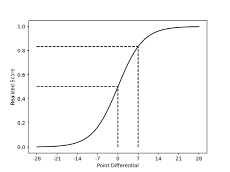

# MathNFL-PowerRank
I have never done something like this. I would like to apply various quantitative approaches to better understand NFL results and create power rankings. My first ideas are
- Applying Elo to measure skill level of teams.
- A Bayesian approach to latent skill variable.

Below I explain each of these approaches, the results will be below in a table.

Eventually I would like to evaluate these results against betting lines and my own thoughts. I will try and record what I think the win probability for each game is every week.

All data for matchups comes from [Pro Football Reference](https://www.pro-football-reference.com/years/2022/games.htm).

---
## Elo
The information on Elo rating system comes from the respective [Wikipedia page](https://en.wikipedia.org/wiki/Elo_rating_system). Here each team $i$ will have a rating $R_i$. I follow the Elo suggested scaling, namely that a difference of 200 points in 2 teams ratings should yield an expected score of 0.75, this means that the team has a 75% chance of winning (if we ignore draws). In reality we will account for draws with a draw being worth 0.5 wins. Hence the expected score for team $j$ when playing against team $j$ will be
$$E_i = \frac{1}{1 + 10^{(R_j - R_i)/400}}.$$
The rank update will occur after each week and works as follows. A team $i$ shall either achieve 1, 0.5, or 0 points based on realized results each week (by winning, drawing, or losing respectively, denoted by $S_i$. The difference between this score and their expected score will be multiplied by a factor $K$, finally this adjustment will be added to their original score.
$$R_i^{\textrm{new}} = R_i^{\textrm{old}} + K (S_i - E_i).$$
$K$ represents the maximal possible adjustment per game, we will experiment with different values here, chess has used 16 for masters and 32 for noobs.
Each team will start out with a ranking of 1000, and each week their ranking will be updated to tell us where they stand. Furthermore a predicted winner of each match will be calculated.

Note that we do not take much into account here, things such as home field advantage are not looked after at all. At week 1, each team will have a equal probability to win or lose, so it may take a few weeks for the ranks to establish themselves. To address this, I will start the simulation from the 2017/18 season. We will reset the ranks using the rank reset factor chosen by optimization.

Another factor I wanted to address was to account for was how much a team won by. In week 3 the Giants 19-16 win over the Panthers should not be valued the same as the Bills 41-7 absolute decimation of the Titans. To do this a win will not count as a score of 1, instead we will use a logistic function based of the point differential. I will fit this logistic function such that the 3 point win is worth around 0.65 points, a 7 point win around 0.8, and a 10 point win around 0.9 points. The 41-7 beatdown will now be worth 0.999 points for the winning team. A logistic factor $\beta=-0.1$ fulfills these conditions, and yields a score curve which looks like:

In implementing the model a range a values were tested across the 2020/21 and 2021/22 season to minimize the mean square error between the expected and realized scores. The values which were minimized over were the logistic rate, the maximal rank change $K$, and a 'reset factor' $r$ which shrinks the ranks after each season. So a reset factor of $0.1$ means that after each season, a team only keep 10% of their previous rank. Testing a range of values for these 3 variables yielded a minimal mean square error for a logistic rate of 100, $K=11$, and $r=0.68$. This yields the following power ranking for week 3 of 2022/23 (read left to right, top to bottom):

<table border="1" class="dataframe">
  <tbody>
    <tr>
      <td>Buffalo Bills</td>
      <td>Tampa Bay Buccaneers</td>
      <td>Kansas City Chiefs</td>
      <td>Los Angeles Rams</td>
    </tr>
    <tr>
      <td>Green Bay Packers</td>
      <td>Miami Dolphins</td>
      <td>Dallas Cowboys</td>
      <td>San Francisco 49ers</td>
    </tr>
    <tr>
      <td>Philadelphia Eagles</td>
      <td>Cincinnati Bengals</td>
      <td>Baltimore Ravens</td>
      <td>Minnesota Vikings</td>
    </tr>
    <tr>
      <td>Tennessee Titans</td>
      <td>Indianapolis Colts</td>
      <td>Cleveland Browns</td>
      <td>New Orleans Saints</td>
    </tr>
    <tr>
      <td>New England Patriots</td>
      <td>Arizona Cardinals</td>
      <td>Denver Broncos</td>
      <td>Seattle Seahawks</td>
    </tr>
    <tr>
      <td>Los Angeles Chargers</td>
      <td>Pittsburgh Steelers</td>
      <td>Las Vegas Raiders</td>
      <td>Chicago Bears</td>
    </tr>
    <tr>
      <td>Atlanta Falcons</td>
      <td>Detroit Lions</td>
      <td>Carolina Panthers</td>
      <td>Washington Commanders</td>
    </tr>
    <tr>
      <td>Jacksonville Jaguars</td>
      <td>Houston Texans</td>
      <td>New York Giants</td>
      <td>New York Jets</td>
    </tr>
  </tbody>
</table>

And gave the Rams a 52% chance to win in the season opener against the Bills (not a great start, but much better than the experts on the pregame show who went around 70% for the Rams). I will continue to update the Elo power rankings each week, hopefully get that automated here soon, as well as some graphics to display the evolution over time.

### Matchup Predictions
The following table lists the matchups, and the predicted chance for team 1 to win (0.46 corresponds to 46%). This is for week 4 of 2022/23.
<table border="1" class="dataframe">
  <thead>
    <tr style="text-align: right;">
      <th>Team 1</th>
      <th>Team 2</th>
      <th>Prediction</th>
    </tr>
  </thead>
  <tbody>
    <tr>
      <td>Miami Dolphins</td>
      <td>Cincinnati Bengals</td>
      <td>0.550260</td>
    </tr>
    <tr>
      <td>Minnesota Vikings</td>
      <td>New Orleans Saints</td>
      <td>0.529323</td>
    </tr>
    <tr>
      <td>Buffalo Bills</td>
      <td>Baltimore Ravens</td>
      <td>0.632970</td>
    </tr>
    <tr>
      <td>Chicago Bears</td>
      <td>New York Giants</td>
      <td>0.571934</td>
    </tr>
    <tr>
      <td>Cleveland Browns</td>
      <td>Atlanta Falcons</td>
      <td>0.576401</td>
    </tr>
    <tr>
      <td>Jacksonville Jaguars</td>
      <td>Philadelphia Eagles</td>
      <td>0.341874</td>
    </tr>
    <tr>
      <td>New York Jets</td>
      <td>Pittsburgh Steelers</td>
      <td>0.351362</td>
    </tr>
    <tr>
      <td>Tennessee Titans</td>
      <td>Indianapolis Colts</td>
      <td>0.501974</td>
    </tr>
    <tr>
      <td>Los Angeles Chargers</td>
      <td>Houston Texans</td>
      <td>0.600669</td>
    </tr>
    <tr>
      <td>Seattle Seahawks</td>
      <td>Detroit Lions</td>
      <td>0.563989</td>
    </tr>
    <tr>
      <td>Washington Commanders</td>
      <td>Dallas Cowboys</td>
      <td>0.332844</td>
    </tr>
    <tr>
      <td>Arizona Cardinals</td>
      <td>Carolina Panthers</td>
      <td>0.581025</td>
    </tr>
    <tr>
      <td>Denver Broncos</td>
      <td>Las Vegas Raiders</td>
      <td>0.537633</td>
    </tr>
    <tr>
      <td>New England Patriots</td>
      <td>Green Bay Packers</td>
      <td>0.382874</td>
    </tr>
    <tr>
      <td>Kansas City Chiefs</td>
      <td>Tampa Bay Buccaneers</td>
      <td>0.489373</td>
    </tr>
    <tr>
      <td>Los Angeles Rams</td>
      <td>San Francisco 49ers</td>
      <td>0.551802</td>
    </tr>
  </tbody>
</table>

## Bayes
While Elo is an easy to implement and understand model, I am an appreciator of Bayesian statistics. So it only makes sense that I try to apply it here. I will preface everything that follows, that I really do not know what I am doing here with applying mathematical models to sports, and am just trying to learn and play with some ideas. Also all my homies hate frequentist statistics, so Bayes all the way baby.

### Intro to Bayes
If you know about Bayesian statistics, this will probably not be helpful to you, or if you just don't care. Also I tried to use very little formulas, and without a chalkboard, that is not easy.

First, a quick lesson on Bayesian approaches ([here](https://en.wikipedia.org/wiki/Bayesian_statistics) is a proper one). Essentially we start out any situation with our prior beliefs (for instance a certain aboreal YouTuber may believe that the Steelers are going to the Superbowl). We quantify these beliefs in terms of a probability distribution. Then upon observing an event, we update our beliefs according to how likely we quantified the event to be.

The following is for demonstrative purposes only, and not actually how the model works. I will take my Giants as an example, say we want to know on average how many of their first 4 games they will win, call this $\mu$. Now I have my beliefs about $\mu$, these are represented by the prior distribution. 

Now the actual amount of games they win is something random around the average, for simplicity say they they have a probability $p$ of winning each game, so the probability that they win all 4 would be given by $p^4$ or the probability that they lost all 4 would be given by $(1-p)^4$.

The Giants play the Titans, Panthers, Cowboys, and Bears. So I would say there is about a 5% chance they win 4 games, a 25% chance they win 3, 50% they win 2, 20% they win 1, and 5% they win 0. Now I have my 'prior' distribution. Note that before we said that each game had a probability $p$ for the Giants to win, and didn't take into account who the opponents were, so we shouldn't have either, but this is an example and shouldn't be taken that seriously. 

Now for a given $\mu$ we can actually find the probability $p$, just take average amount of wins $\mu$ and divide it by the number of games (4), to find the probability $p$ for this given $\mu$. 

After week 4, I will have a realization of how many times the Giants won (hopefully it isn't 0) that was partially due to the value of $\mu$. Remember, we **don't** know the value of $\mu$ and only have some belief. Now for every possible value of $\mu$ we evaluate what the likelihood of our observation was, and call this $f(x | \mu)$. Say the Giants won all 4 games, if $\mu$ was equal to 4, then $p = 4/4 =1$, so $p^4 = 1^4 =1$, and this had a 100% chance of happening (in math terms $f(x=4| \mu=4) = 1$). The story isn't so simple for another value of $\mu$, say 3. We get that $p = \frac{3}{4}=0.75$, then the likelihood to have won 4 games is $\binom{4}{3}0.75^3(1-0.75) \approx 0.42$. The wierd term at the beginning is the binomial coefficient and just deals with how many different ways you can win 3 out of 4 games, and all that is relevant here is that we have that the likelihood $f(x=4 | \mu=3) = 0.42$ of what we observed (4 wins) given the wins on average (3), is about 42%. The model will continue to calculate the likelihoods for $\mu = 0,1,2$, but that would be a pain (this is why we make computers do it). 

In the end we would have a likelihood of the observation for each value of $\mu$, we then would weight this value by our prior belief, so in the case of our prior guess being  that $\mu$ equals 3 with probability 25% and the likelihoood of 42% , we get that the probability that $\mu$ being equal to 3, given the fact that we observed 4 wins is $25\% * 42\% * C$ where $C$ is a constant we have to calculate as well, but is not needed to be understood here (it is about 0.25). So we have that the probability that $\mu$ is equal to 3, given the observed 4 wins is 25%. The probability of $\mu=4$ is now 20%, so we can see that now we believe that our prior beliefs have changed quite a lot (we used to think that $\mu=4$ has probability 5%).

This was probably very confusing and my apologies are in order

## The actual model
I am writing this half to explain it, and half to figure out exactly how exactly the model should work. Hence, the lack of clarity.

Although probably not as powerful as the almighty _algorithm_ by Jackson Krueger, I hope to be able to compare his ideas to mine. From now on we will use skill level and rating interchangebly. We will use a latent variable to measure the skill level of a given team $i$. We will call this $S_i$. This is the variable we are interested in measuring, but we will never see it directly. We will say that in a given game, each team realizes a skill level based on some distribution. The team with the higher realized skill level then wins the match. Hence, we have that 
$$\mathbb{P} [ i \textrm{ wins against } j ] = \mathbb{P} [ S_i > S_j ] .$$
We have the problem of draws here (if the distributions are continuous), I have not figured out exactly how I am going to deal with that yet.

For simplicity, we will work with normal distributions for now. We will say each team's skill is distributed around a mean $mu_i$ with standard deviation $\sigma_i$ (this may end up being the same for all teams). Our prior is then on the $mu_i$ (may have to have one on the $\sigma_i$ as well if we do not fix those at the beginning), let this just be a standard normal for now. Then with a match between $i$ and $j$, we are observing the probability that $i>j$. We then get a posterior after the match (say $i$ wins)
$$\pi(\mu_i = x, \mu_j = y | i \textrm{ won}] = \frac{f(i>j | x,y) \pi(x,y)}{\int f(i>j | x,y) \pi(x,y) dxdy }.$$
Where $f(i>j | x,y)$ is the probability that the difference of independent normals centered around $x$ and $y$ is positive, i.e. 
$$\mathbb{P}\left[Z > - \frac{\mu_i - \mu_j}{\sigma_i + \sigma_j} \right].$$
This is not looking like it is going to have a nice conjugate prior. But that is an effort for later. So for now this will have to be done numerically.

To do this numerically each team will start out with a standard normally distributed random variable, this is our original prior. After observing a result, we shall be able to update this, with the observation (say team $i$ wins) conditional on the skill difference being normally distributed about the difference. The probability to observe $i$ winning will the be the area under the distribution to the right of 0 (if the difference is $S_i - S_j$, otherwise to the left). The parameters used for the numerical simulation are that each distribution will be represented by 1000 points between $[-5,5]$ (step size 0.01). 

# Historical ratings
## Elo Ratings
Here are the historical ratings generated by the Elo algorithm. The column name corresponds to the rankings _after_ that week. The most recent ranking is on the far left, the oldest on the far right. Week 0 corresponds to the rankings after the last season which were used to initialize this year.

<table border="1" class="dataframe">
  <thead>
    <tr style="text-align: right;">
      <th></th>
      <th>Week 3</th>
      <th>Week 2</th>
      <th>Week 1</th>
      <th>Week 0</th>
    </tr>
  </thead>
  <tbody>
    <tr>
      <th>0</th>
      <td>Buffalo Bills</td>
      <td>Buffalo Bills</td>
      <td>Kansas City Chiefs</td>
      <td>Kansas City Chiefs</td>
    </tr>
    <tr>
      <th>1</th>
      <td>Tampa Bay Buccaneers</td>
      <td>Tampa Bay Buccaneers</td>
      <td>Buffalo Bills</td>
      <td>Buffalo Bills</td>
    </tr>
    <tr>
      <th>2</th>
      <td>Kansas City Chiefs</td>
      <td>Kansas City Chiefs</td>
      <td>Tampa Bay Buccaneers</td>
      <td>Tampa Bay Buccaneers</td>
    </tr>
    <tr>
      <th>3</th>
      <td>Los Angeles Rams</td>
      <td>Los Angeles Rams</td>
      <td>Los Angeles Rams</td>
      <td>Los Angeles Rams</td>
    </tr>
    <tr>
      <th>4</th>
      <td>Green Bay Packers</td>
      <td>Green Bay Packers</td>
      <td>Miami Dolphins</td>
      <td>Green Bay Packers</td>
    </tr>
    <tr>
      <th>5</th>
      <td>Miami Dolphins</td>
      <td>Miami Dolphins</td>
      <td>Green Bay Packers</td>
      <td>San Francisco 49ers</td>
    </tr>
    <tr>
      <th>6</th>
      <td>Dallas Cowboys</td>
      <td>San Francisco 49ers</td>
      <td>Minnesota Vikings</td>
      <td>Dallas Cowboys</td>
    </tr>
    <tr>
      <th>7</th>
      <td>San Francisco 49ers</td>
      <td>Dallas Cowboys</td>
      <td>New Orleans Saints</td>
      <td>Cincinnati Bengals</td>
    </tr>
    <tr>
      <th>8</th>
      <td>Philadelphia Eagles</td>
      <td>Cincinnati Bengals</td>
      <td>Cincinnati Bengals</td>
      <td>Tennessee Titans</td>
    </tr>
    <tr>
      <th>9</th>
      <td>Cincinnati Bengals</td>
      <td>Philadelphia Eagles</td>
      <td>Dallas Cowboys</td>
      <td>New Orleans Saints</td>
    </tr>
    <tr>
      <th>10</th>
      <td>Baltimore Ravens</td>
      <td>New Orleans Saints</td>
      <td>San Francisco 49ers</td>
      <td>Indianapolis Colts</td>
    </tr>
    <tr>
      <th>11</th>
      <td>Minnesota Vikings</td>
      <td>Baltimore Ravens</td>
      <td>Indianapolis Colts</td>
      <td>Miami Dolphins</td>
    </tr>
    <tr>
      <th>12</th>
      <td>Tennessee Titans</td>
      <td>Los Angeles Chargers</td>
      <td>Tennessee Titans</td>
      <td>New England Patriots</td>
    </tr>
    <tr>
      <th>13</th>
      <td>Indianapolis Colts</td>
      <td>New England Patriots</td>
      <td>Baltimore Ravens</td>
      <td>Seattle Seahawks</td>
    </tr>
    <tr>
      <th>14</th>
      <td>Cleveland Browns</td>
      <td>Tennessee Titans</td>
      <td>Seattle Seahawks</td>
      <td>Baltimore Ravens</td>
    </tr>
    <tr>
      <th>15</th>
      <td>New Orleans Saints</td>
      <td>Minnesota Vikings</td>
      <td>Los Angeles Chargers</td>
      <td>Minnesota Vikings</td>
    </tr>
    <tr>
      <th>16</th>
      <td>New England Patriots</td>
      <td>Arizona Cardinals</td>
      <td>Pittsburgh Steelers</td>
      <td>Los Angeles Chargers</td>
    </tr>
    <tr>
      <th>17</th>
      <td>Arizona Cardinals</td>
      <td>Pittsburgh Steelers</td>
      <td>New England Patriots</td>
      <td>Arizona Cardinals</td>
    </tr>
    <tr>
      <th>18</th>
      <td>Denver Broncos</td>
      <td>Seattle Seahawks</td>
      <td>Philadelphia Eagles</td>
      <td>Cleveland Browns</td>
    </tr>
    <tr>
      <th>19</th>
      <td>Seattle Seahawks</td>
      <td>Indianapolis Colts</td>
      <td>Cleveland Browns</td>
      <td>Pittsburgh Steelers</td>
    </tr>
    <tr>
      <th>20</th>
      <td>Los Angeles Chargers</td>
      <td>Cleveland Browns</td>
      <td>Arizona Cardinals</td>
      <td>Philadelphia Eagles</td>
    </tr>
    <tr>
      <th>21</th>
      <td>Pittsburgh Steelers</td>
      <td>Denver Broncos</td>
      <td>Las Vegas Raiders</td>
      <td>Las Vegas Raiders</td>
    </tr>
    <tr>
      <th>22</th>
      <td>Las Vegas Raiders</td>
      <td>Las Vegas Raiders</td>
      <td>Chicago Bears</td>
      <td>Denver Broncos</td>
    </tr>
    <tr>
      <th>23</th>
      <td>Chicago Bears</td>
      <td>Chicago Bears</td>
      <td>Washington Commanders</td>
      <td>Washington Commanders</td>
    </tr>
    <tr>
      <th>24</th>
      <td>Atlanta Falcons</td>
      <td>Detroit Lions</td>
      <td>Denver Broncos</td>
      <td>Chicago Bears</td>
    </tr>
    <tr>
      <th>25</th>
      <td>Detroit Lions</td>
      <td>Washington Commanders</td>
      <td>Atlanta Falcons</td>
      <td>Atlanta Falcons</td>
    </tr>
    <tr>
      <th>26</th>
      <td>Carolina Panthers</td>
      <td>Atlanta Falcons</td>
      <td>Houston Texans</td>
      <td>Detroit Lions</td>
    </tr>
    <tr>
      <th>27</th>
      <td>Washington Commanders</td>
      <td>Houston Texans</td>
      <td>Detroit Lions</td>
      <td>Houston Texans</td>
    </tr>
    <tr>
      <th>28</th>
      <td>Jacksonville Jaguars</td>
      <td>New York Giants</td>
      <td>Carolina Panthers</td>
      <td>Carolina Panthers</td>
    </tr>
    <tr>
      <th>29</th>
      <td>Houston Texans</td>
      <td>Carolina Panthers</td>
      <td>New York Giants</td>
      <td>New York Giants</td>
    </tr>
    <tr>
      <th>30</th>
      <td>New York Giants</td>
      <td>Jacksonville Jaguars</td>
      <td>New York Jets</td>
      <td>New York Jets</td>
    </tr>
    <tr>
      <th>31</th>
      <td>New York Jets</td>
      <td>New York Jets</td>
      <td>Jacksonville Jaguars</td>
      <td>Jacksonville Jaguars</td>
    </tr>
  </tbody>
</table>

## Elo Predictions
Here is the performance of the Elo Algorithm. 1 Thumbs up means the correct winner was predicted, 2 if the winner was correct and the point differential was within 7, and 3 if the winner was correct and the differential was within 3. 1 Thumbs down means the incorrect winner was predicted and the point differential was more than 7, 2 if the winner was incorrect and the point differential was within 7, and 3 if the winner was incorrect and the differential was within 3. Note that the parameter optimization was done for the mean squared error of logistic scores, so another choice of parameters may perform better here. Trying to optimize the parameters to minimize the difference between predicted and realized score differential is something I still want to try.

<table border="1" class="dataframe">
  <thead>
    <tr style="text-align: right;">
      <th>Date</th>
      <th>Winner/tie</th>
      <th>Loser/tie</th>
      <th>Game Score</th>
      <th>Accuracy</th>
      <th>Normalized Score</th>
      <th>Prediction</th>
    </tr>
  </thead>
  <tbody>
    <tr>
      <td>2022-09-26</td>
      <td>Dallas Cowboys</td>
      <td>New York Giants</td>
      <td>23-16</td>
      <td>:+1::+1::+1:</td>
      <td>0.834</td>
      <td>0.781</td>
    </tr>
    <tr>
      <td>2022-09-25</td>
      <td>Denver Broncos</td>
      <td>San Francisco 49ers</td>
      <td>11-10</td>
      <td>:-1::-1:</td>
      <td>0.557</td>
      <td>0.324</td>
    </tr>
    <tr>
      <td>2022-09-25</td>
      <td>Atlanta Falcons</td>
      <td>Seattle Seahawks</td>
      <td>27-23</td>
      <td>:-1::-1::-1:</td>
      <td>0.715</td>
      <td>0.333</td>
    </tr>
    <tr>
      <td>2022-09-25</td>
      <td>Los Angeles Rams</td>
      <td>Arizona Cardinals</td>
      <td>20-12</td>
      <td>:+1::+1:</td>
      <td>0.863</td>
      <td>0.645</td>
    </tr>
    <tr>
      <td>2022-09-25</td>
      <td>Green Bay Packers</td>
      <td>Tampa Bay Buccaneers</td>
      <td>14-12</td>
      <td>:-1:</td>
      <td>0.613</td>
      <td>0.463</td>
    </tr>
    <tr>
      <td>2022-09-25</td>
      <td>Jacksonville Jaguars</td>
      <td>Los Angeles Chargers</td>
      <td>38-10</td>
      <td>:-1::-1::-1:</td>
      <td>0.998</td>
      <td>0.246</td>
    </tr>
    <tr>
      <td>2022-09-25</td>
      <td>Minnesota Vikings</td>
      <td>Detroit Lions</td>
      <td>28-24</td>
      <td>:+1::+1::+1:</td>
      <td>0.715</td>
      <td>0.661</td>
    </tr>
    <tr>
      <td>2022-09-25</td>
      <td>Indianapolis Colts</td>
      <td>Kansas City Chiefs</td>
      <td>20-17</td>
      <td>:-1::-1:</td>
      <td>0.666</td>
      <td>0.355</td>
    </tr>
    <tr>
      <td>2022-09-25</td>
      <td>Cincinnati Bengals</td>
      <td>New York Jets</td>
      <td>27-12</td>
      <td>:+1:</td>
      <td>0.969</td>
      <td>0.765</td>
    </tr>
    <tr>
      <td>2022-09-25</td>
      <td>Carolina Panthers</td>
      <td>New Orleans Saints</td>
      <td>22-14</td>
      <td>:-1::-1::-1:</td>
      <td>0.863</td>
      <td>0.264</td>
    </tr>
    <tr>
      <td>2022-09-25</td>
      <td>Baltimore Ravens</td>
      <td>New England Patriots</td>
      <td>37-26</td>
      <td>:-1::-1::-1:</td>
      <td>0.926</td>
      <td>0.472</td>
    </tr>
    <tr>
      <td>2022-09-25</td>
      <td>Miami Dolphins</td>
      <td>Buffalo Bills</td>
      <td>21-19</td>
      <td>:-1::-1:</td>
      <td>0.613</td>
      <td>0.342</td>
    </tr>
    <tr>
      <td>2022-09-25</td>
      <td>Tennessee Titans</td>
      <td>Las Vegas Raiders</td>
      <td>24-22</td>
      <td>:+1::+1::+1:</td>
      <td>0.613</td>
      <td>0.622</td>
    </tr>
    <tr>
      <td>2022-09-25</td>
      <td>Philadelphia Eagles</td>
      <td>Washington Commanders</td>
      <td>24-8</td>
      <td>:+1:</td>
      <td>0.975</td>
      <td>0.572</td>
    </tr>
    <tr>
      <td>2022-09-25</td>
      <td>Chicago Bears</td>
      <td>Houston Texans</td>
      <td>23-20</td>
      <td>:+1::+1::+1:</td>
      <td>0.666</td>
      <td>0.547</td>
    </tr>
    <tr>
      <td>2022-09-22</td>
      <td>Cleveland Browns</td>
      <td>Pittsburgh Steelers</td>
      <td>29-17</td>
      <td>:+1:</td>
      <td>0.941</td>
      <td>0.504</td>
    </tr>
    <tr>
      <td>2022-09-19</td>
      <td>Philadelphia Eagles</td>
      <td>Minnesota Vikings</td>
      <td>24-7</td>
      <td>:-1::-1::-1:</td>
      <td>0.980</td>
      <td>0.491</td>
    </tr>
    <tr>
      <td>2022-09-19</td>
      <td>Buffalo Bills</td>
      <td>Tennessee Titans</td>
      <td>41-7</td>
      <td>:+1:</td>
      <td>1.000</td>
      <td>0.606</td>
    </tr>
    <tr>
      <td>2022-09-18</td>
      <td>Green Bay Packers</td>
      <td>Chicago Bears</td>
      <td>27-10</td>
      <td>:+1:</td>
      <td>0.980</td>
      <td>0.754</td>
    </tr>
    <tr>
      <td>2022-09-18</td>
      <td>Denver Broncos</td>
      <td>Houston Texans</td>
      <td>16-9</td>
      <td>:+1::+1:</td>
      <td>0.834</td>
      <td>0.583</td>
    </tr>
    <tr>
      <td>2022-09-18</td>
      <td>Dallas Cowboys</td>
      <td>Cincinnati Bengals</td>
      <td>20-17</td>
      <td>:+1::+1::+1:</td>
      <td>0.666</td>
      <td>0.588</td>
    </tr>
    <tr>
      <td>2022-09-18</td>
      <td>Arizona Cardinals</td>
      <td>Las Vegas Raiders</td>
      <td>29-23</td>
      <td>:+1::+1:</td>
      <td>0.799</td>
      <td>0.540</td>
    </tr>
    <tr>
      <td>2022-09-18</td>
      <td>Los Angeles Rams</td>
      <td>Atlanta Falcons</td>
      <td>31-27</td>
      <td>:+1::+1::+1:</td>
      <td>0.715</td>
      <td>0.736</td>
    </tr>
    <tr>
      <td>2022-09-18</td>
      <td>San Francisco 49ers</td>
      <td>Seattle Seahawks</td>
      <td>27-7</td>
      <td>:+1:</td>
      <td>0.990</td>
      <td>0.541</td>
    </tr>
    <tr>
      <td>2022-09-18</td>
      <td>New England Patriots</td>
      <td>Pittsburgh Steelers</td>
      <td>17-14</td>
      <td>:+1::+1::+1:</td>
      <td>0.666</td>
      <td>0.567</td>
    </tr>
    <tr>
      <td>2022-09-18</td>
      <td>New York Giants</td>
      <td>Carolina Panthers</td>
      <td>19-16</td>
      <td>:-1::-1:</td>
      <td>0.666</td>
      <td>0.465</td>
    </tr>
    <tr>
      <td>2022-09-18</td>
      <td>Detroit Lions</td>
      <td>Washington Commanders</td>
      <td>36-27</td>
      <td>:-1::-1::-1:</td>
      <td>0.888</td>
      <td>0.437</td>
    </tr>
    <tr>
      <td>2022-09-18</td>
      <td>Tampa Bay Buccaneers</td>
      <td>New Orleans Saints</td>
      <td>20-10</td>
      <td>:+1:</td>
      <td>0.909</td>
      <td>0.604</td>
    </tr>
    <tr>
      <td>2022-09-18</td>
      <td>Miami Dolphins</td>
      <td>Baltimore Ravens</td>
      <td>42-38</td>
      <td>:+1::+1:</td>
      <td>0.715</td>
      <td>0.545</td>
    </tr>
    <tr>
      <td>2022-09-18</td>
      <td>Jacksonville Jaguars</td>
      <td>Indianapolis Colts</td>
      <td>24-0</td>
      <td>:-1::-1::-1:</td>
      <td>0.996</td>
      <td>0.198</td>
    </tr>
    <tr>
      <td>2022-09-18</td>
      <td>New York Jets</td>
      <td>Cleveland Browns</td>
      <td>31-30</td>
      <td>:-1::-1:</td>
      <td>0.557</td>
      <td>0.287</td>
    </tr>
    <tr>
      <td>2022-09-15</td>
      <td>Kansas City Chiefs</td>
      <td>Los Angeles Chargers</td>
      <td>27-24</td>
      <td>:+1::+1::+1:</td>
      <td>0.666</td>
      <td>0.688</td>
    </tr>
    <tr>
      <td>2022-09-12</td>
      <td>Seattle Seahawks</td>
      <td>Denver Broncos</td>
      <td>17-16</td>
      <td>:+1::+1::+1:</td>
      <td>0.557</td>
      <td>0.593</td>
    </tr>
    <tr>
      <td>2022-09-11</td>
      <td>Tampa Bay Buccaneers</td>
      <td>Dallas Cowboys</td>
      <td>19-3</td>
      <td>:+1:</td>
      <td>0.975</td>
      <td>0.570</td>
    </tr>
    <tr>
      <td>2022-09-11</td>
      <td>Los Angeles Chargers</td>
      <td>Las Vegas Raiders</td>
      <td>24-19</td>
      <td>:+1::+1:</td>
      <td>0.760</td>
      <td>0.543</td>
    </tr>
    <tr>
      <td>2022-09-11</td>
      <td>New York Giants</td>
      <td>Tennessee Titans</td>
      <td>21-20</td>
      <td>:-1::-1:</td>
      <td>0.557</td>
      <td>0.239</td>
    </tr>
    <tr>
      <td>2022-09-11</td>
      <td>Minnesota Vikings</td>
      <td>Green Bay Packers</td>
      <td>23-7</td>
      <td>:-1::-1::-1:</td>
      <td>0.975</td>
      <td>0.288</td>
    </tr>
    <tr>
      <td>2022-09-11</td>
      <td>Kansas City Chiefs</td>
      <td>Arizona Cardinals</td>
      <td>44-21</td>
      <td>:+1:</td>
      <td>0.995</td>
      <td>0.642</td>
    </tr>
    <tr>
      <td>2022-09-11</td>
      <td>Baltimore Ravens</td>
      <td>New York Jets</td>
      <td>24-9</td>
      <td>:+1:</td>
      <td>0.969</td>
      <td>0.741</td>
    </tr>
    <tr>
      <td>2022-09-11</td>
      <td>Cleveland Browns</td>
      <td>Carolina Panthers</td>
      <td>26-24</td>
      <td>:+1::+1::+1:</td>
      <td>0.613</td>
      <td>0.629</td>
    </tr>
    <tr>
      <td>2022-09-11</td>
      <td>Chicago Bears</td>
      <td>San Francisco 49ers</td>
      <td>19-10</td>
      <td>:-1::-1::-1:</td>
      <td>0.888</td>
      <td>0.351</td>
    </tr>
    <tr>
      <td>2022-09-11</td>
      <td>Pittsburgh Steelers</td>
      <td>Cincinnati Bengals</td>
      <td>23-20</td>
      <td>:-1::-1:</td>
      <td>0.666</td>
      <td>0.431</td>
    </tr>
    <tr>
      <td>2022-09-11</td>
      <td>Miami Dolphins</td>
      <td>New England Patriots</td>
      <td>20-7</td>
      <td>:-1::-1::-1:</td>
      <td>0.952</td>
      <td>0.428</td>
    </tr>
    <tr>
      <td>2022-09-11</td>
      <td>Washington Commanders</td>
      <td>Jacksonville Jaguars</td>
      <td>28-22</td>
      <td>:+1::+1::+1:</td>
      <td>0.799</td>
      <td>0.703</td>
    </tr>
    <tr>
      <td>2022-09-11</td>
      <td>Houston Texans</td>
      <td>Indianapolis Colts</td>
      <td>20-20</td>
      <td>:-1::-1:</td>
      <td>0.500</td>
      <td>0.232</td>
    </tr>
    <tr>
      <td>2022-09-11</td>
      <td>Philadelphia Eagles</td>
      <td>Detroit Lions</td>
      <td>38-35</td>
      <td>:+1::+1::+1:</td>
      <td>0.666</td>
      <td>0.718</td>
    </tr>
    <tr>
      <td>2022-09-11</td>
      <td>New Orleans Saints</td>
      <td>Atlanta Falcons</td>
      <td>27-26</td>
      <td>:+1::+1::+1:</td>
      <td>0.557</td>
      <td>0.667</td>
    </tr>
    <tr>
      <td>2022-09-08</td>
      <td>Buffalo Bills</td>
      <td>Los Angeles Rams</td>
      <td>31-10</td>
      <td>:+1:</td>
      <td>0.992</td>
      <td>0.552</td>
    </tr>
  </tbody>
</table>